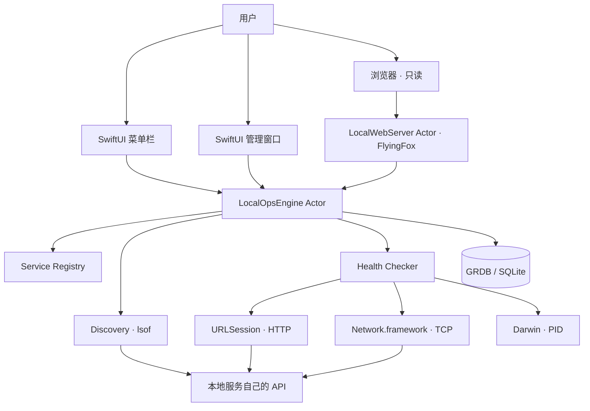

# LocalOps 详细架构

更新日期：2026-07-26
架构版本：6.0
目标产品：v0.4.0 纯 Swift 只读管理基线

## 1. 一句话架构

LocalOps 是一个单进程、原生 macOS 菜单栏应用：SwiftUI 和 FlyingFox 共享同一个 `LocalOpsEngine` Actor，GRDB / SQLite 保存服务、历史和事件，macOS 系统适配器负责只读发现与健康检查。



## 2. 两种 API 必须分开

### 2.1 用户服务自己的 API

oMLX、LTX、数据库或开发服务可以自己提供 API。LocalOps 对它们只做：

- 按配置的 URL 发出健康检查；
- 记录 HTTP 状态、延迟和有限 JSON 摘要；
- 连接失败时显示离线原因；
- 在原生界面或只读 Web 页打开服务入口。

LocalOps 不控制“服务内部 API 开关”。服务的 API 是否启用由该服务自己的配置决定。

### 2.2 LocalOps 的只读 Web 服务

FlyingFox 嵌入 `LocalOps.app`，不是独立后台，也不是服务控制面。

```text
GET /                         只读信息页
GET /healthz                  LocalOps Web 存活
GET /readyz                   Core 是否已初始化
GET /api/v1/overview          状态总览
GET /api/v1/services          服务列表
GET /api/v1/services/:id      服务详情
GET /api/v1/events            最近事件
```

不注册 POST、PUT、PATCH 或 DELETE 路由。Web 页面每 15 秒读取一次 Core 已缓存的 snapshot，不会因为浏览器请求而执行新的 `lsof` 扫描。

## 3. 进程边界

v0.4 只有一个产品进程：

```text
LocalOps.app/Contents/MacOS/LocalOps
├── AppKit NSStatusItem
├── SwiftUI Views
├── LocalOpsEngine Actor
├── LocalWebServer Actor
└── SQLite connection
```

不再存在：

- `localopsd`；
- LocalOps 自身的 LaunchAgent；
- Swift 客户端到 Python 后端的 HTTP 通信；
- Python 虚拟环境或 PyInstaller 二进制；
- FastAPI / Jinja 运行时。

退出 `LocalOps.app` 会同时结束菜单栏、管理窗口和 FlyingFox。用户的本地服务不受影响。

## 4. Core Actor

`LocalOpsEngine` 是唯一业务入口，负责：

1. 执行数据库 migration；
2. 导入旧 YAML 定义并插入默认服务；
3. 加载已启用的服务定义；
4. 运行只读端口发现；
5. 并发执行 HTTP / TCP / PID 检查；
6. 组装登记、待登记和历史掉线 snapshot；
7. 保存状态变化与事件；
8. 向 SwiftUI 和 FlyingFox 返回不可变的 `LocalOpsOverview`。

SwiftUI 不直接访问 GRDB，FlyingFox 也不重新实现健康检查。

## 5. 服务状态模型

生命周期和健康度是两个维度：

```text
lifecycle: unknown | stopped | running
health:    unknown | healthy | degraded | unhealthy
```

| 组合 | 含义 |
|---|---|
| `running + healthy` | 进程与业务接口均正常 |
| `running + unhealthy` | 端口有进程，但健康地址返回错误或连接失败 |
| `stopped + unhealthy` | 未找到监听进程且健康检查失败 |
| `running + unknown` | 扫描到端口，但未登记健康规则 |
| `unknown + unknown` | 没有足够信息判断 |

当 HTTP 检查失败但配置端口仍有监听进程时，Core 保留 `running + unhealthy`，避免把错误路径或 HTTP 500 误判为进程已停止。

## 6. 发现与历史身份

发现器固定调用：

```text
/usr/sbin/lsof -nP -iTCP -sTCP:LISTEN -Fpcn
```

它不读取完整命令行，避免把可能的 token 或密钥保存到 SQLite。对每个进程只补充：

- 可执行文件路径；
- 工作目录；
- RSS 内存；
- CPU 占用；
- PID、端口和监听地址。

历史 id 由下列材料的 SHA-256 前 16 个十六进制字符生成：

```text
executable_path \0 normalized_host \0 port
```

因此进程重启换 PID 后仍是同一条历史记录。

## 7. 主机运维指标

`SystemMetricsReader` 在每次 Core 刷新时直接读取本机状态：

| 指标 | 来源 | 说明 |
|---|---|---|
| 内存 | Mach `host_statistics64` | 已用、总量和比例 |
| 磁盘 | `URLResourceValues` | 可用、总量和已用比例 |
| CPU Load | Darwin `getloadavg` | 1、5、15 分钟系统负载 |
| 逻辑核心 | `ProcessInfo` | 用于解释 Load 数值 |
| 开机时长 | `ProcessInfo.systemUptime` | 不依赖外部命令 |
| 热状态 | `ProcessInfo.thermalState` | 正常、偏热、严重或临界 |

热状态是 macOS 实际用于系统降频与保护决策的公开信号。精确摄氏温度需要私有 SMC 或特权工具，不具备稳定兼容性，因此当前不采集。所有主机指标都无需 `sudo`，不启动额外常驻进程，也不写入数据库。

## 8. 持久化

主数据库：

```text
~/Library/Application Support/LocalOps/.data/localops.sqlite3
```

| 表 | 用途 |
|---|---|
| `services` | 服务定义、endpoint 和健康规则 |
| `service_state` | 已登记服务的最新状态 |
| `events` | 上线、掉线、恢复和健康变化 |
| `service_catalog` | 自动发现和最近掉线记录 |
| `action_audit` | 为未来受控启停保留的兼容表，v0.4 不写入 |

`DefaultServices.json` 仅用于首次插入 oMLX 和 LTX Studio 等默认条目。用户数据不会因为 App 升级被覆盖。

## 9. 旧版迁移

启动顺序：

1. 如果 `localops.sqlite3` 不存在但 `cockpit.sqlite3` 存在，复制旧数据库；
2. GRDB 以 `IF NOT EXISTS` 方式补充 Swift 版 schema；
3. 用纯 Swift 的有限迁移解析器读取旧 `services.yaml` 与 `claimed-services.yaml`；
4. 将条目 `INSERT OR IGNORE` 进 `services`；
5. 旧 YAML 保留在磁盘上作为回滚备份，不再是运行时依赖；
6. 删除两个固定 label 且内容确认属于 LocalOps 的旧 LaunchAgent。

迁移不删除旧数据库或 YAML。

## 10. 并发模型

- `LocalOpsEngine` Actor 串行化 snapshot 组装和业务状态；
- GRDB `DatabaseQueue` 再保证 SQLite 访问顺序；
- HTTP / TCP 检查用 task group 并发执行；
- SwiftUI 模型限定在 `MainActor`；
- FlyingFox 路由只读取 Engine 的 cached overview；
- TCP 探测用一次性 continuation gate 避免超时与连接回调重复 resume。

## 11. 安全边界

- FlyingFox 固定绑定 `127.0.0.1`；
- 不添加 CORS 头；
- Web 只有 GET；
- HTML 使用 Content Security Policy；
- 前端使用 DOM `textContent` 显示服务数据，不把扫描内容插入 `innerHTML`；
- 发现项默认只读；
- 不接受任意 shell 字符串；
- v0.4 不包含任何服务启停实现。

因为只读 Web 没有控制能力，v0.4 不要求 Bearer Token。如果未来开放局域网或增加操作路由，必须重新引入认证、CSRF 防护和操作审计。

## 12. 启停管理的预留边界

未来可能的 adapter：

```text
observe
app
cli
launchd
container
```

但 v0.4 的数据模型不将其写死。只有确定下列问题后才实现：

- 什么样的官方 CLI 才能被认为可靠生命周期接口；
- 前台进程是否由 LocalOps 托管；
- LocalOps 退出时托管进程如何存活；
- 何时自动生成 LaunchAgent；
- 如何做命令确认、超时、幂等和审计。

这使 v0.4 可以先成为可靠的本地服务目录，而不会在管理方式尚未明确时引入危险控制面。
